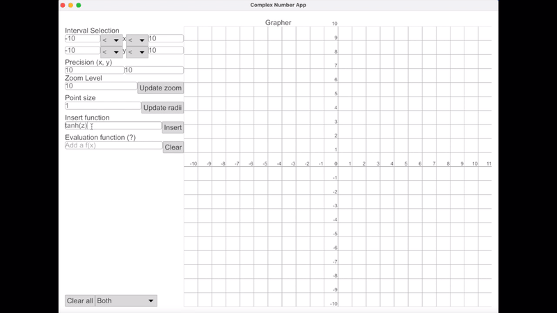

# Cauchy

[](./archive/showcase.mp4)

Complex Number application for

- Basic calculations
- Basic functions
- Function graphing
- Function evaluation on contour
- Function evaluation on ranges
- Symbolic parser

Future implementations will be:

- Integrating and differentiating
- Series

## Get started

```
cargo run --package app
```

## Dependencies

- iced - GUI: Their code is forked, app code is inside `app` folder
- num-complex - For complex numbers, functions, and utilities

## Features

### Calculator

- PEMDAS operations
- Variable saving and using
- Clearing
- Functions:
  | Function name | Code |
  | ---------------------- | ----- |
  | Sine | sin |
  | Cosine | cos |
  | Tangent | tan |
  | Cosecant | csc |
  | Secant | sec |
  | Cotangent | cot |
  | Arc-sine | asin |
  | Arc-cosine | acos |
  | Arc-tangent | atan |
  | Hyperbolic sine | sinh |
  | Hyperbolic cosine | cosh |
  | Hyperbolic tangent | tanh |
  | Hyperbolic Arc-sine | asinh |
  | Hyperbolic Arc-cosine | acosh |
  | Hyperbolic Arc-tangent | atanh |
  | Inverse | inv |
  | Complex Conjugate | conj |
  | Exponential (e^z) | exp |
  | Square root | sqrt |
  | Cube root | cbrt |
  | Natural logarithm | ln |
- Constants:
  | Constant name | Code |
  | ---------------------- | ----- |
  | Imaginary number | i |
  | Natural number | E |
  | Pi | PI |
- Operators:
  | Operator name | Code |
  | ---------------------- | ----- |
  | Addition | + |
  | Subtraction | - |
  | Multiplication | \* |
  | Division | / |
  | Powers | ^ |
  | Parentheses | () |

### Grapher

- All operations as in calculator
- Evaluation ranges (`X`: real axis, `Y`: imaginary axis)
- Precision (Decimal precision)
- Zooming (minimum 1)
- Point sizes
- Function evaluator (`z` is taken as the evaluation variable)
- Contour evaluation (if provided, it is used with the real evaluation range `X` to make the contour points) (`x` is taken as evaluation variable for contour definition)
- Point colors (change as `X` and `Y` points are evaluated if used)

### Calculus

TBD

### Series

TBD
